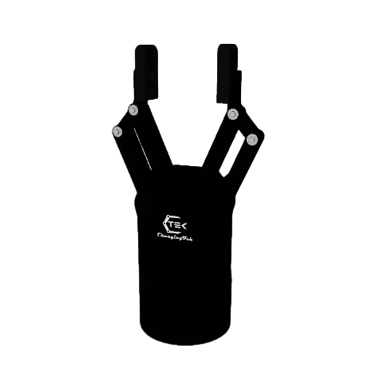
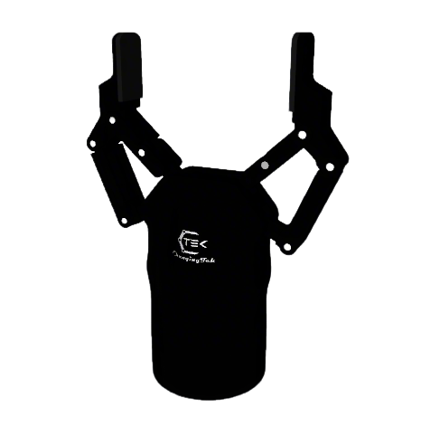
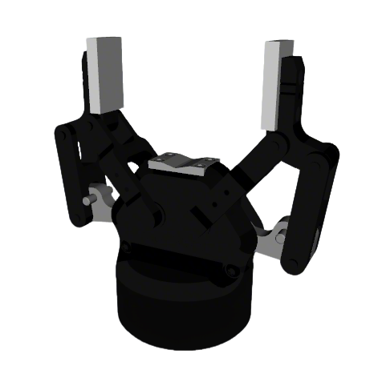
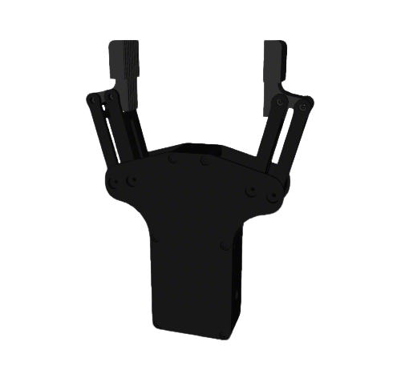
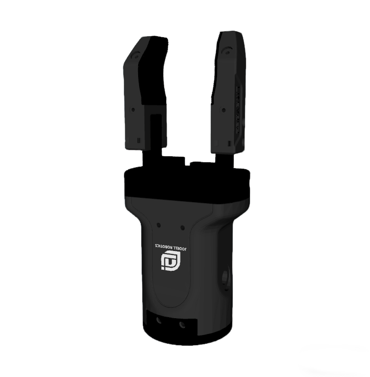
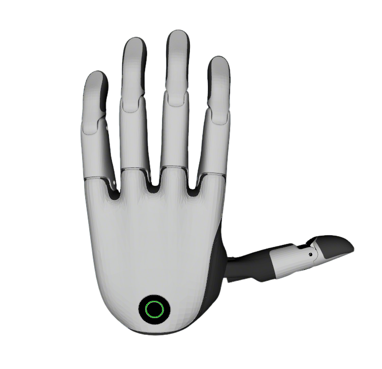
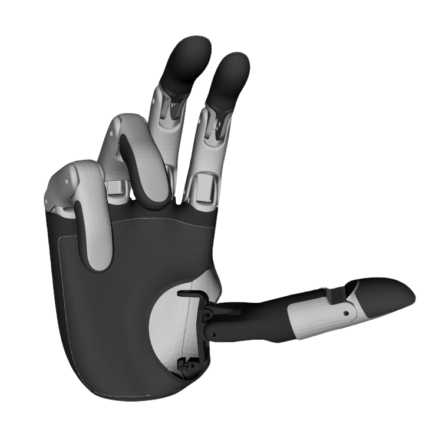
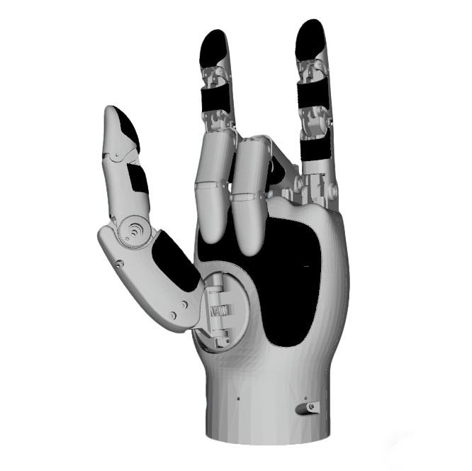
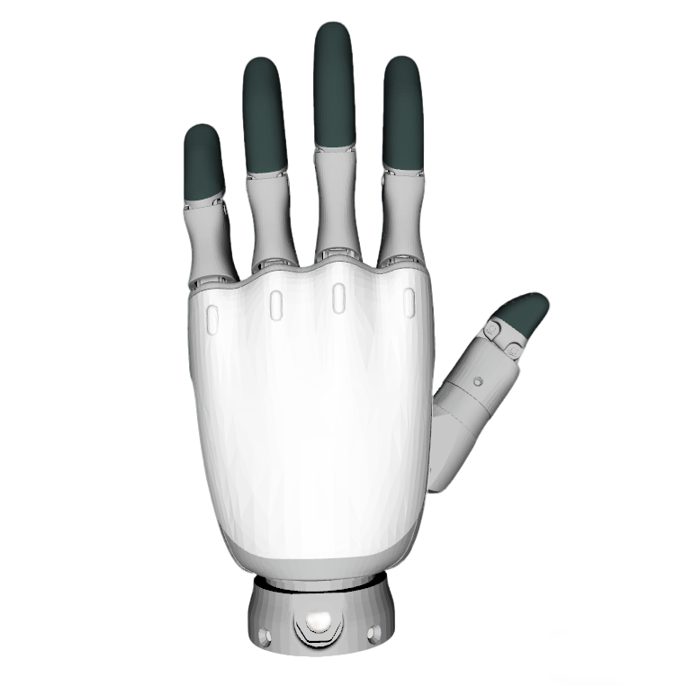

# Robot Descriptions - Common Components

This repository contains shared robot description files including grippers, dexterous hands, sensor models, and common launch utilities for ROS2 robots.

## Overview

This is a git submodule of the main [robot_descriptions](https://github.com/fiveages-sim/robot_descriptions) repository, containing commonly used end-effectors and sensors that can be attached to various robot platforms.

## Components

### Grippers

Located in `gripper/` directory:

| Brand                                | Models               | Repaint | Images                                                                                                                                                                                                              |
|--------------------------------------|----------------------|---------|---------------------------------------------------------------------------------------------------------------------------------------------------------------------------------------------------------------------|
| [ChangingTek](gripper/changingtek_description) | AG2F90-C<br>AG2F120S | Yes     |                                                                                                     |
| [Robotiq](gripper/robotiq_description)         | 2F-85                | Yes     |                                                                                                                                                               |
| [Inspire](gripper/inspire_description)         | EG2-4C2              | Yes     |                                                                                                                                                              |
| [Jodell](gripper/jodell_description)           | RG75-300             | Yes     |                                                                                                                                                              |

Each gripper package includes:
- URDF/Xacro files for robot description
- 3D meshes (collision and visual)
- ROS2 Control configurations
- Mounting configurations for various robot arms

### Dexterous Hands

Located in `dexhands/` directory:

| Brand                                      | Model        | Repaint | Images                                                                                                                                                                                                              |
|--------------------------------------------|--------------|---------|---------------------------------------------------------------------------------------------------------------------------------------------------------------------------------------------------------------------|
| [BrainCo](dexhands/brainco_description)    | REVO2        | Yes     |                                                                                     |
| [LinkerHand](dexhands/linkerhand_description) | O7           | Yes     |                                                                                                                                                          |
| [OyMotion](dexhands/oymotion_description)  | RoHand Gen2  | Yes     |                                                                                                                                                            |

Features:
- Full kinematic chain definition
- Support for both left and right hands
- Individual finger joint control
- High-quality visual meshes

### Sensor Models

Located in `sensor_models/` directory:

Includes URDF descriptions and meshes for:
- Intel RealSense D405
- Intel RealSense D435
- Orbbec Dabai
- Livox Mid-360

These sensor models can be easily integrated into robot descriptions for simulation and visualization.

### Common Launch Files

Located in `robot_common_launch/` directory:

A collection of reusable launch files and utilities:

#### Visualization
- `visualize/gripper.launch.py` - Launch gripper visualization
- `visualize/hand.launch.py` - Launch dexterous hand visualization
- `visualize/manipulator.launch.py` - Launch manipulator visualization
- `visualize/humanoid.launch.py` - Launch humanoid robot visualization

#### Control
- `control/controller_manager.launch.py` - Launch ROS2 controller manager
- `control/diff_drive.launch.py` - Launch differential drive controller
- `control/hardware_visualize.launch.py` - Launch hardware visualization

#### Manipulation
- `manipulation/manipulator_ocs2.launch.py` - Launch OCS2 MPC for manipulators

#### Navigation
- `navigation/navigation.launch.py` - Launch Nav2 stack
- `navigation/cartographer.launch.py` - Launch Cartographer SLAM
- `navigation/navigation_slam.launch.py` - Launch Nav2 with SLAM
- `navigation/amr_rctk.launch.py` - Launch AMR RCTK navigation

Also includes:
- RViz configuration files
- Navigation parameter files (Nav2, SLAM Toolbox, Cartographer)
- Gazebo bridge configurations
- Simulation world files

## Usage

### As Part of Robot Description

To use these components in your robot description, you can include them using xacro:

```xml
<!-- Example: Adding a gripper to your robot -->
<xacro:include filename="$(find robotiq_description)/xacro/gripper.xacro"/>

<xacro:robotiq_gripper 
  parent="arm_link_6" 
  name="gripper">
  <origin xyz="0 0 0" rpy="0 0 0"/>
</xacro:robotiq_gripper>
```

### Using Common Launch Files

```bash
# Visualize a gripper
ros2 launch robot_common_launch gripper.launch.py

# Launch manipulator with OCS2 MPC
ros2 launch robot_common_launch manipulator_ocs2.launch.py

# Start navigation with SLAM
ros2 launch robot_common_launch navigation_slam.launch.py
```

## Package Structure

```
common/
├── sensor_models/          # Sensor URDF models
├── dexhands/              # Dexterous hand descriptions
│   ├── brainco_description/
│   ├── linkerhand_description/
│   └── oymotion_description/
├── gripper/               # Gripper descriptions
│   ├── changingtek_description/
│   ├── inspire_description/
│   ├── jodell_description/
│   └── robotiq_description/
└── robot_common_launch/   # Common launch files and utilities
    ├── config/           # Configuration files (RViz, Nav2, etc.)
    ├── launch/           # Launch files
    └── worlds/           # Simulation world files
```
