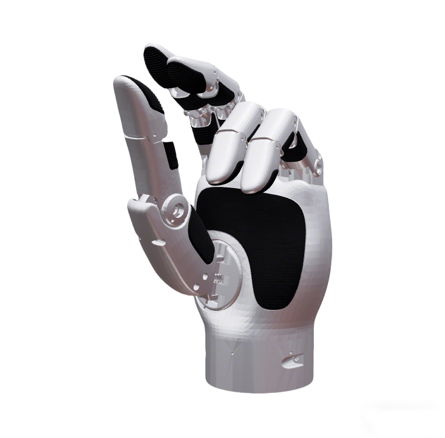

# LinkerHand DexHands Description

This package contains the URDF and related files for the LinkerHand DexHands. Origin files could be found at [LinkerHand](https://github.com/linker-bot/linkerhand-urdf).

## 1. Build

```bash
cd ~/ros2_ws
colcon build --packages-up-to linkerhand_description --symlink-install
```

## 2. Visualize the DexHands

### 2.1 O7 DexHands
* Left Hand
  ```bash
  # left hand
  source ~/ros2_ws/install/setup.bash
  ros2 launch robot_common_launch hand.launch.py hand:=linkerhand
  ```
  
    
* Right Hand
  ```bash
  # right hand
  source ~/ros2_ws/install/setup.bash
  ros2 launch robot_common_launch hand.launch.py hand:=linkerhand direction:=-1
  ```

### 2.1 O6 DexHands
* Left Hand
  ```bash
  # left hand
  source ~/ros2_ws/install/setup.bash
  ros2 launch robot_common_launch hand.launch.py hand:=linkerhand type:=o6
  ```
  

* Right Hand
  ```bash
  # right hand
  source ~/ros2_ws/install/setup.bash
  ros2 launch robot_common_launch hand.launch.py hand:=linkerhand type:=o6 direction:=-1
  ```


## 3. ROS2 Control Demo
<<<<<<< HEAD
### 3.1 O7 DexHands
* Left Hand
  ```bash
  source ~/ros2_ws/install/setup.bash
  ros2 launch basic_joint_controller hand.launch.py
  ```
* Right Hand
  ```bash
  source ~/ros2_ws/install/setup.bash
  ros2 launch basic_joint_controller hand.launch.py direction:=-1
  ```

### 3.2 O6 DexHands
* Left Hand
  ```bash
  source ~/ros2_ws/install/setup.bash
  ros2 launch basic_joint_controller hand.launch.py type:=o6
  ```
* Right Hand
  ```bash
  source ~/ros2_ws/install/setup.bash
  ros2 launch basic_joint_controller hand.launch.py type:=o6 direction:=-1
  ```
=======

### 3.1 Mock Component Simulation
```bash
source ~/ros2_ws/install/setup.bash
ros2 launch basic_joint_controller hand.launch.py
```

### 3.2 Real Hardware with Modbus ROS2 Control

To use the real O7 dexterous hand with Modbus communication:

```bash
# 1. Set serial port permissions
sudo chmod 666 /dev/ttyUSB0  # Adjust port as needed

# 2. Launch with real hardware
source ~/ros2_ws/install/setup.bash
ros2 launch basic_joint_controller hand.launch.py \
    hand:=linkerhand \
    type:=o7 \
    hardware:=real \
    direction:=1

# For right hand (direction=-1)
ros2 launch basic_joint_controller hand.launch.py \
    hand:=linkerhand \
    type:=o7 \
    hardware:=real \
    direction:=-1
```

**Parameters:**
- `hand:=linkerhand` - Hand name
- `type:=o7` - Hand type (O7 dexterous hand)
- `hardware:=real` - Use real hardware (Modbus ROS2 Control)
- `direction:=1` - Left hand (direction=-1 for right hand)

**Note:** The `serial_port` is defined in the xacro file (`linkerhand_description/xacro/ros2_control/hand.xacro`) with a default value of `/dev/ttyUSB0`. To change it, modify the xacro file directly or pass it as a xacro argument when processing the file.
>>>>>>> d723d6a (Add support for dexhands)
