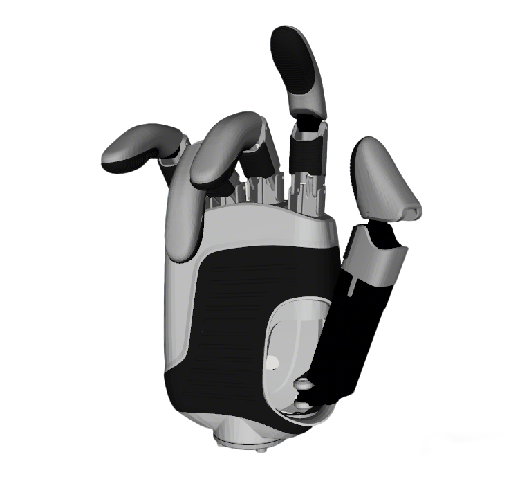

# LinkerHand DexHands Description

This package contains the URDF and related files for the LinkerHand DexHands. Origin files could be found at [LinkerHand](https://github.com/linker-bot/linkerhand-urdf).

## 1. Build

```bash
cd ~/ros2_ws
colcon build --packages-up-to linkerhand_description --symlink-install
```

## 2. Visualize the DexHands

### 2.1 O7 DexHands
* Left Hand
  ```bash
  # left hand
  source ~/ros2_ws/install/setup.bash
  ros2 launch robot_common_launch hand.launch.py hand:=linkerhand
  ```
  
    
* Right Hand
  ```bash
  # right hand
  source ~/ros2_ws/install/setup.bash
  ros2 launch robot_common_launch hand.launch.py hand:=linkerhand direction:=-1
  ```

### 2.2 O6 DexHands
* Left Hand
  ```bash
  # left hand
  source ~/ros2_ws/install/setup.bash
  ros2 launch robot_common_launch hand.launch.py hand:=linkerhand type:=o6
  ```
  

* Right Hand
  ```bash
  # right hand
  source ~/ros2_ws/install/setup.bash
  ros2 launch robot_common_launch hand.launch.py hand:=linkerhand type:=o6 direction:=-1
  ```
### 2.3 L6 DexHands
* Left Hand
  ```bash
  # left hand
  source ~/ros2_ws/install/setup.bash
  ros2 launch robot_common_launch hand.launch.py hand:=linkerhand type:=l6
  ```
  

* Right Hand
  ```bash
  # right hand
  source ~/ros2_ws/install/setup.bash
  ros2 launch robot_common_launch hand.launch.py hand:=linkerhand type:=l6 direction:=-1
  ```


## 3. ROS2 Control Demo

### 3.1 O7 DexHands
* Left Hand
  ```bash
  source ~/ros2_ws/install/setup.bash
  ros2 launch basic_joint_controller hand.launch.py
  ```
* Right Hand
  ```bash
  source ~/ros2_ws/install/setup.bash
  ros2 launch basic_joint_controller hand.launch.py direction:=-1
  ```

### 3.2 O6 DexHands
* Left Hand
  ```bash
  source ~/ros2_ws/install/setup.bash
  ros2 launch basic_joint_controller hand.launch.py type:=o6
  ```
* Right Hand
  ```bash
  source ~/ros2_ws/install/setup.bash
  ros2 launch basic_joint_controller hand.launch.py type:=o6 direction:=-1
  ```

### 3.3 L6 DexHands
* Left Hand
  ```bash
  source ~/ros2_ws/install/setup.bash
  ros2 launch basic_joint_controller hand.launch.py type:=l6
  ```
* Right Hand
  ```bash
  source ~/ros2_ws/install/setup.bash
  ros2 launch basic_joint_controller hand.launch.py type:=l6 direction:=-1
  ```

## 4. Real Hardware with Modbus ROS2 Control

### 4.1 Modbus Protocol Configuration

All LinkerHand dexterous hands (O7, O6, L6) use **Modbus RTU** protocol for communication:

- **Protocol**: Modbus RTU
- **Supported Function Codes**: 
  - `04`: Read Input Registers (read current joint positions)
  - `16`: Write Multiple Holding Registers (write target joint positions)
- **Baudrate**: `115200` (fixed, not configurable)
- **Stop Bits**: `1` (fixed)
- **Data Bits**: `8` (fixed)
- **Parity**: `None` (fixed)
- **Modbus Slave IDs**:
  - Right Hand: `0x27` (39 decimal) - use `direction:=-1`
  - Left Hand: `0x28` (40 decimal) - use `direction:=1` (default)

### 4.2 O7 Dexterous Hand

To use the real O7 dexterous hand (7-DOF) with Modbus communication:

```bash
# 1. Set serial port permissions
sudo chmod 666 /dev/ttyUSB0  # Adjust port as needed

# 2. Launch with real hardware - Left Hand (default, Modbus ID 0x28)
source ~/ros2_ws/install/setup.bash
ros2 launch basic_joint_controller hand.launch.py \
    hand:=linkerhand \
    type:=o7 \
    hardware:=real \
    direction:=1 \
    serial_port:=/dev/ttyUSB0

# 3. Launch with real hardware - Right Hand (Modbus ID 0x27)
ros2 launch basic_joint_controller hand.launch.py \
    hand:=linkerhand \
    type:=o7 \
    hardware:=real \
    direction:=-1 \
    serial_port:=/dev/ttyUSB0
```

### 4.3 O6 Dexterous Hand

To use the real O6 dexterous hand (6-DOF) with Modbus communication:

```bash
# 1. Set serial port permissions
sudo chmod 666 /dev/ttyUSB0  # Adjust port as needed

# 2. Launch with real hardware - Left Hand (default, Modbus ID 0x28)
source ~/ros2_ws/install/setup.bash
ros2 launch basic_joint_controller hand.launch.py \
    hand:=linkerhand \
    type:=o6 \
    hardware:=real \
    direction:=1 \
    serial_port:=/dev/ttyUSB0

# 3. Launch with real hardware - Right Hand (Modbus ID 0x27)
ros2 launch basic_joint_controller hand.launch.py \
    hand:=linkerhand \
    type:=o6 \
    hardware:=real \
    direction:=-1 \
    serial_port:=/dev/ttyUSB0
```

### 4.4 L6 Dexterous Hand

To use the real L6 dexterous hand (6-DOF) with Modbus communication:

```bash
# 1. Set serial port permissions
sudo chmod 666 /dev/ttyUSB0  # Adjust port as needed

# 2. Launch with real hardware - Left Hand (default, Modbus ID 0x28)
source ~/ros2_ws/install/setup.bash
ros2 launch basic_joint_controller hand.launch.py \
    hand:=linkerhand \
    type:=l6 \
    hardware:=real \
    direction:=1 \
    serial_port:=/dev/ttyUSB0

# 3. Launch with real hardware - Right Hand (Modbus ID 0x27)
ros2 launch basic_joint_controller hand.launch.py \
    hand:=linkerhand \
    type:=l6 \
    hardware:=real \
    direction:=-1 \
    serial_port:=/dev/ttyUSB0
```

### 4.5 Launch Parameters

**Common Parameters:**
- `hand:=linkerhand` - Hand name (required)
- `type:=o7|o6|l6` - Hand type: `o7` (7-DOF), `o6` (6-DOF), or `l6` (6-DOF)
- `hardware:=real` - Use real hardware (Modbus ROS2 Control)
- `direction:=1` - Left hand (Modbus ID 0x28) - **default**
- `direction:=-1` - Right hand (Modbus ID 0x27)
- `serial_port:=/dev/ttyUSB0` - Serial port path (default: `/dev/ttyUSB0`)

**Note:** The `serial_port` parameter can be passed via launch argument. The default value is `/dev/ttyUSB0` as defined in the xacro file.

### 4.6 Troubleshooting

If you encounter "Connection timed out" errors:

1. **Check Modbus Slave ID**: 
   - Verify the hand's configured Modbus ID matches the `direction` parameter
   - Left hand should be `0x28` (direction=1)
   - Right hand should be `0x27` (direction=-1)

2. **Check Serial Port**:
   ```bash
   # Verify port exists
   ls -l /dev/ttyUSB*
   
   # Check permissions
   sudo chmod 666 /dev/ttyUSB0
   
   # Check if another process is using it
   sudo lsof /dev/ttyUSB0
   ```

3. **Verify Device Connection**:
   - Ensure device is powered on
   - Check USB cable connection
   - Try a different USB port if available

4. **Test Modbus Communication**:
   ```bash
   # Install mbpoll if needed
   sudo apt-get install mbpoll
   
   # Test reading from left hand (Modbus ID 0x28 = 40 decimal)
   mbpoll -m rtu -b 115200 -a 40 -r 0 -c 6 /dev/ttyUSB0
   
   # Test reading from right hand (Modbus ID 0x27 = 39 decimal)
   mbpoll -m rtu -b 115200 -a 39 -r 0 -c 6 /dev/ttyUSB0
   ```

5. **Check Launch Output**:
   - Look for the hand configuration message: `[INFO] Hand configuration: left hand (direction=1, Modbus ID=0x28)`
   - Verify the Modbus ID matches your device configuration
