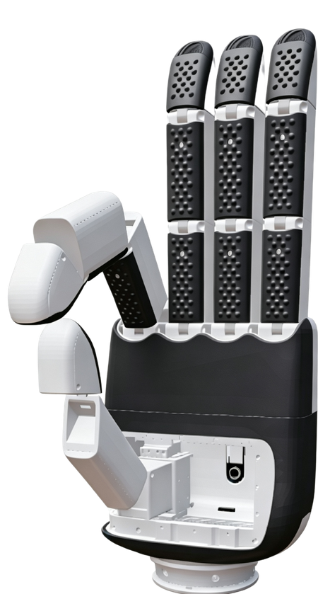

# TheoHand DexHands Description

This package contains the URDF and related files for the TheoHand STD16A dexterous hand.

## 1. Build

```bash
cd ~/ros2_ws
colcon build --packages-up-to theohand_description --symlink-install
```

## 2. Visualize the DexHands


### 2.1 STD16A DexHands

* Left Hand
  ```bash
  source ~/ros2_ws/install/setup.bash
  ros2 launch robot_common_launch hand.launch.py hand:=theohand type:=std16a
  ```
  

* Right Hand
  ```bash
  source ~/ros2_ws/install/setup.bash
  ros2 launch robot_common_launch hand.launch.py hand:=theohand type:=std16a direction:=-1
  ```

## 3. ROS2 Control Demo

### 3.1 STD16A DexHands

* Left Hand
  ```bash
  source ~/ros2_ws/install/setup.bash
  ros2 launch basic_joint_controller hand.launch.py hand:=theohand type:=std16a
  ```
* Right Hand
  ```bash
  source ~/ros2_ws/install/setup.bash
  ros2 launch basic_joint_controller hand.launch.py hand:=theohand type:=std16a direction:=-1
  ```

## 4. Real Hardware with Modbus ROS2 Control

### 4.1 Modbus Protocol Configuration

TheoHand STD16A (16-DOF) uses **Modbus RTU** protocol for communication:

- **Protocol**: Modbus RTU
- **Supported Function Codes**:
  - `03`: Read Holding Registers (actual positions from `0x0051`)
  - `06`: Write Single Register (control word at `0x0000`)
  - `16`: Write Multiple Holding Registers (target positions from `0x0001`)
- **Baudrate**: `115200` (default)
- **Stop Bits**: `1` (fixed)
- **Data Bits**: `8` (fixed)
- **Parity**: `None` (fixed)
- **Modbus Slave ID**: left `2`, right `1`

### 4.2 STD16A Dexterous Hand

To use the real STD16A dexterous hand (16-DOF) with Modbus communication:
Left hand:

```bash
ros2 launch basic_joint_controller hand.launch.py hand:=theohand type:=std16a hardware:=real direction:=1 serial_port:=/dev/ttyUSB0
```

Right hand:

```bash
ros2 launch basic_joint_controller hand.launch.py hand:=theohand type:=std16a hardware:=real direction:=-1 serial_port:=/dev/ttyUSB0
```

### 4.3 Launch Parameters

**Common Parameters:**
- `hand:=theohand` - Hand name (required)
- `type:=std16a` - Hand type: STD16A (16-DOF)
- `hardware:=real` - Use real hardware (Modbus ROS2 Control)
- `direction:=1` - Left hand URDF mirror - **default**
- `direction:=-1` - Right hand URDF mirror
- `serial_port:=/dev/ttyUSB0` - Serial port path (default: `/dev/ttyUSB0`)
- `slave_id` - Modbus slave ID: left `2`, right `1`

**Note:** The `serial_port` parameter can be passed via launch argument. The default value is `/dev/ttyUSB0` as defined in the xacro file.
