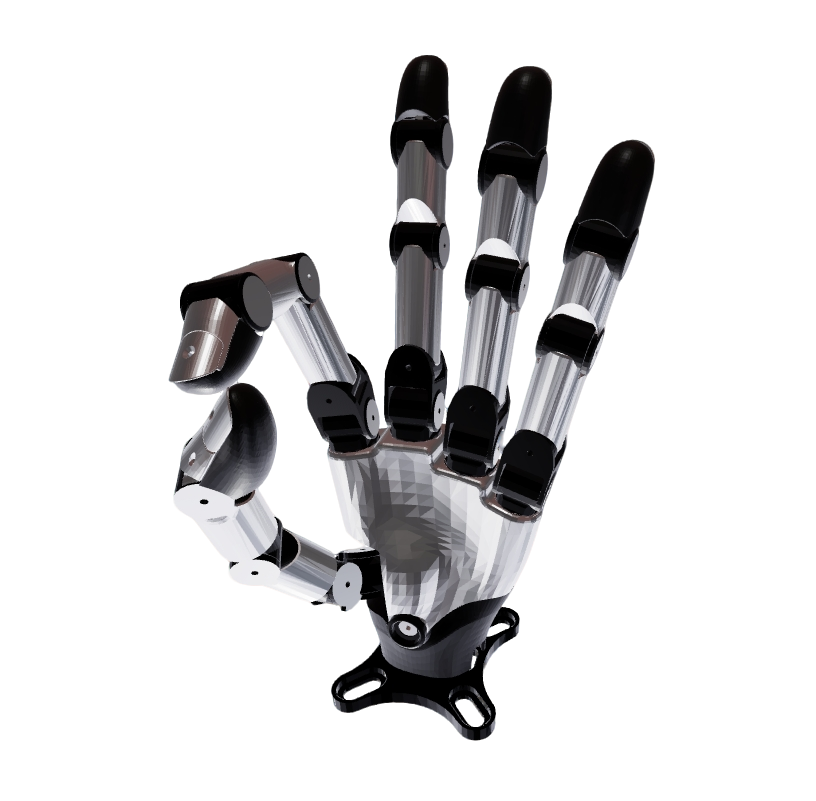

# Wuji DexHands Description

URDF / xacro for Wuji Hand 2 (Beta 2), adapted for motion control in `robot-descriptions-common/dexhands` (fa_w2 / ROS 2 Jazzy).

Official source assets (geometry reference only): [wuji-description](https://github.com/wuji-technology/wuji-description)

**Included types**

| `type` | Official source | Notes |
|--------|-----------------|-------|
| `hand2` (default) | `hand2/hand2_beta2` | 20-DOF anatomical joint names + tip sensor frames |

Not packaged: `hand_soft`, `hand2_beta1`, `glove`, MJCF/USD/STEP.

Naming: `hand:=wuji` selects this package. Entry files are named `hand.xacro`. Generated URDF robot name is `Wuji_hand2`; dual standalone uses `Wuji_hands2`.

## 1. Build

```bash
cd ~/ros2_ws   # or this workspace
colcon build --packages-select wuji_description --symlink-install
source install/setup.bash
```

## 2. Visualize the DexHands



```bash
ros2 launch robot_common_launch hand.launch.py hand:=wuji
# right:
ros2 launch robot_common_launch hand.launch.py hand:=wuji direction:=-1
# optional: use_mount:=true
```

## 3. ROS2 Control Demo (mock)

Uses `basic_joint_controller` with `mock_components` by default. Controllers load `config/ros2_control/hand2.yaml`.

```bash
ros2 launch basic_joint_controller hand.launch.py hand:=wuji type:=hand2
ros2 launch basic_joint_controller hand.launch.py hand:=wuji type:=hand2 direction:=-1
```

Confirm the log shows `hand2.yaml`.

Open/close (when controller is active):

```bash
ros2 topic pub --once /hand_joint_controller/target_command std_msgs/msg/Int32 "data: 0"  # close -> home_2
ros2 topic pub --once /hand_joint_controller/target_command std_msgs/msg/Int32 "data: 1"  # open  -> home_1
```

### 3.1 Dual Hand2 (standalone)

One robot tree with `left_hand_*` / `right_hand_*` prefixes, two HI systems, `left_hand_controller` + `right_hand_controller`:

- Xacro: `xacro/ros2_control/hands2.xacro` (instantiates `WujiHand2` twice)
- Controllers: `config/ros2_control/hands2.yaml`
- Launch: `ros2 launch wuji_ros2_control hands2.launch.py hardware:=mock_components`

```bash
ros2 topic pub --once /left_hand_controller/target_command std_msgs/msg/Int32 "data: 1"
ros2 topic pub --once /right_hand_controller/target_command std_msgs/msg/Int32 "data: 1"
```

## 4. Joint names

Standalone uses empty `name` prefix. On an arm, pass `name:=left_hand` / `right_hand` → `left_hand_<joint>`.

| Finger | Joints |
|--------|--------|
| Thumb | `thumb_cmc_flex`, `thumb_cmc_abd`, `thumb_mcp`, `thumb_ip` |
| Index | `index_finger_mcp_flex`, `index_finger_mcp_abd`, `index_finger_pip`, `index_finger_dip` |
| Middle | `middle_finger_mcp_flex`, `middle_finger_mcp_abd`, `middle_finger_pip`, `middle_finger_dip` |
| Ring | `ring_mcp_flex`, `ring_mcp_abd`, `ring_pip`, `ring_dip` |
| Pinky | `pinky_mcp_flex`, `pinky_mcp_abd`, `pinky_pip`, `pinky_dip` |

Ring names drop the official `finger` token (`ring_finger_*` → `ring_*`) so standalone RViz JointControlPanel does not mis-classify them as `right_hand` (leading `r` + `finger` heuristic). Links follow the same rename (`ring_proximal`, …). SDK / firmware order is unchanged — map by index in a future HI.

Fixed tip / tip-sensor frames exist for TF but are not commanded.

## 5. L/R mirroring and frames

### Wrist frames

| Link | Role |
|------|------|
| `hand_base` | External wrist for fa_w2 / dexhands; **+Z = finger extension** (same idea as LinkerHand O6) |
| `wrist` | Official beta2 wrist mesh + finger roots; fingers extend in **−Z** of this frame |
| `wrist_align` | Fixed `R_x(π)` mapping official −Z onto `hand_base` +Z |

Joint names, order, and limits are unchanged — simulation controllers and a future HardwareInterface still use joint-space angles (no sign flip for +Z). When mounting on an arm, calibrate `*_hand_base_joint` against this **+Z** `hand_base`.

- `direction:=1` left (default), `direction:=-1` right
- Single geometric tree + `direction` formulas (joint origins / axes)
- **Mesh:** left `.glb` + `scale="1 ${direction} 1"` (same mesh format family as LinkerHand / BrainCo). Index/middle/ring share `digit_*`; pinky keeps official `l_pinky_proximal` / `proximal_abd` / `middle` (distal + tip_sensor still share `digit_*`).
- `thumb_mcp` / `pinky_mcp_flex`: forced mirror for joint-space control (~1–3 mm fingertip FK vs official right URDF)

Whole-robot attach pattern (same as LinkerHand):

```xml
<xacro:WujiHand2 name="${side}_hand" direction="${1 if side == 'left' else -1}" use_mount="true"/>
```

Side controller template: `config/ros2_control/templates/hand2.side.yaml`.

## 6. Real hardware

- Demos: `mock_components` / `gz` / `isaac`
- `hardware:=real` → plugin `wuji_ros2_control/WujiHand2Hardware` (Ethernet + `libwuji_sdk_c`)
- Description never writes `device_address` / `serial_number`. HI scans and matches `hand_side`. Do **not** put addresses in arm / `robot.local.yaml`.
- `mit_kp` / `mit_kd` / `effort_limit` are hardcoded URDF activate seeds (`3.0` / `0.05` / `1.5`). After start, hot-tune them on the hardware node (`/wuji_hand_system` or `/wuji_hand2_left_system` / `/wuji_hand2_right_system`); see `wuji_ros2_control` README. Not launch args.

```bash
# mock
ros2 launch basic_joint_controller hand.launch.py hand:=wuji type:=hand2
# real — scan + hand_side from direction
ros2 launch wuji_ros2_control hand2.launch.py hardware:=real direction:=1
```

Controller YAML: `hand2.yaml` (position command; position+velocity state). See `wuji_ros2_control` README for connection, MIT hot-tune, and joint-index calibration.

## 7. Package layout

```
wuji_description/
├── meshes/hand2/                # beta2 left .glb + digit_* (+ Y-scale in xacro)
├── xacro/hand.xacro             # standalone dispatcher
├── xacro/hand2.xacro            # WujiHand2
├── xacro/ros2_control/          # hand.xacro, hands2.xacro, side_systems.xacro, …
└── config/ros2_control/         # hand2.yaml, hands2.yaml, templates/
```
