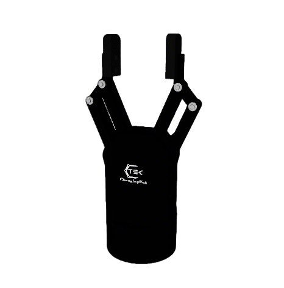
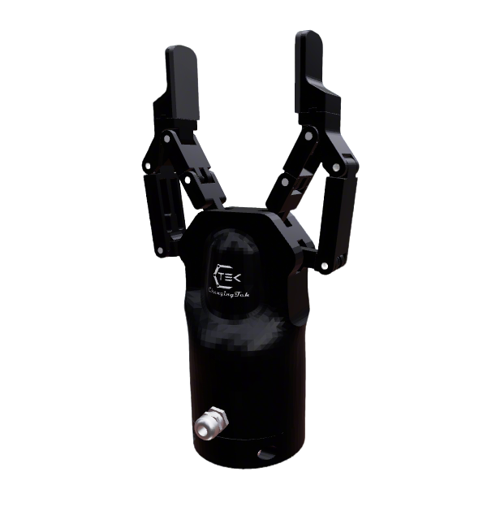

# ChangingTek Gripper Description

This package contains the URDF and related files for the ChangingTek Grippers. Origin files could be found at [ChangingTek](https://gitee.com/Ice_Panda/changingtek).

## 1. Build

```bash
cd ~/ros2_ws
colcon build --packages-up-to changingtek_description --symlink-install
```

## 2. Visualize the Gripper

* AG2F90-C Gripper
  ```bash
  source ~/ros2_ws/install/setup.bash
  ros2 launch robot_common_launch gripper.launch.py gripper:=changingtek
  ```
  ```bash
  source ~/ros2_ws/install/setup.bash
  ros2 launch robot_common_launch gripper.launch.py gripper:=changingtek type:=AG2F90-C-Soft
  ```

  
* AG2F120S Gripper
  ```bash
  source ~/ros2_ws/install/setup.bash
  ros2 launch robot_common_launch gripper.launch.py gripper:=changingtek type:=AG2F120S
  ```
  

## 3. ROS2 Control Demos
### 3.1 Mock Component
* AG2F90-C
  ```bash
  source ~/ros2_ws/install/setup.bash
  ros2 launch adaptive_gripper_controller demo.launch.py
  ```
* AG2F120S
  ```bash
  source ~/ros2_ws/install/setup.bash
  ros2 launch adaptive_gripper_controller demo.launch.py type:=AG2F120S
  ```
  
### 3.2 Real Gripper
* AG2F90-C
  ```bash
  source ~/ros2_ws/install/setup.bash
  ros2 launch adaptive_gripper_controller demo.launch.py hardware:=real
  ```