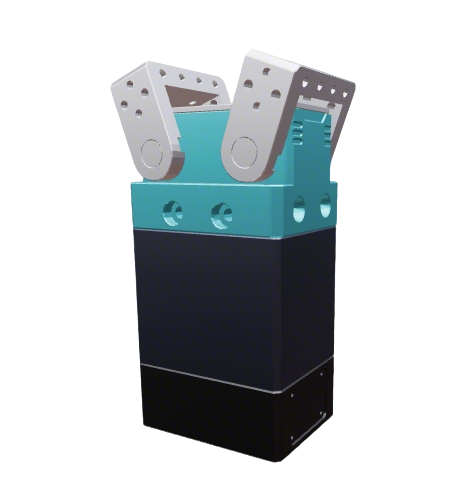

# Eincinx Gripper Description

This package contains the URDF and related files for Eincinx grippers (EPGI180-v2).

## Build

```bash
cd ~/ros2_ws
colcon build --packages-up-to eincinx_description --symlink-install
```

## Visualize the Gripper

### EPGI180（含 flange + adapter）

```bash
source ~/ros2_ws/install/setup.bash
ros2 launch robot_common_launch gripper.launch.py gripper:=eincinx
```



### EPGI180-bare（裸夹爪，无 flange / adapter）

```bash
source ~/ros2_ws/install/setup.bash
ros2 launch robot_common_launch gripper.launch.py gripper:=eincinx type:=epgi180-bare
```
