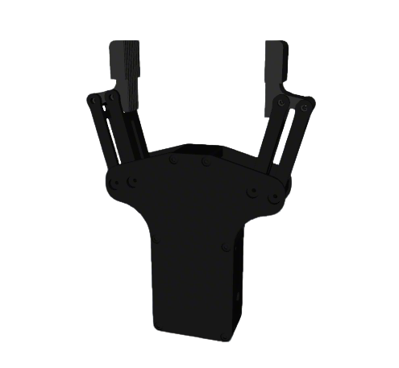
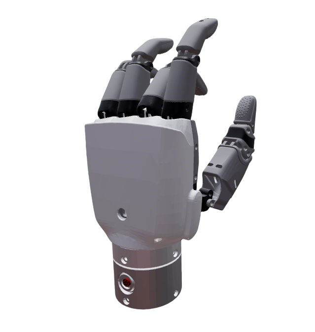
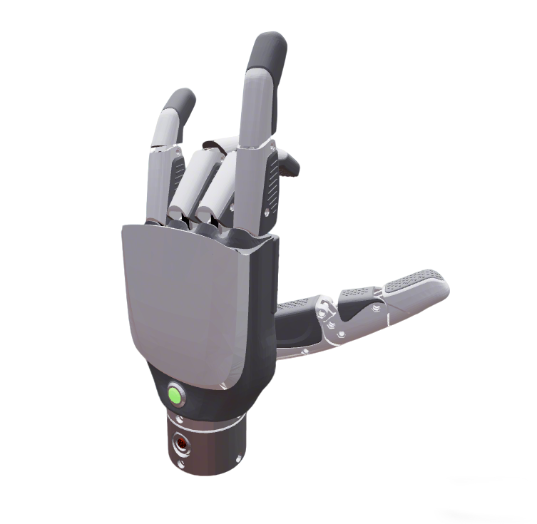
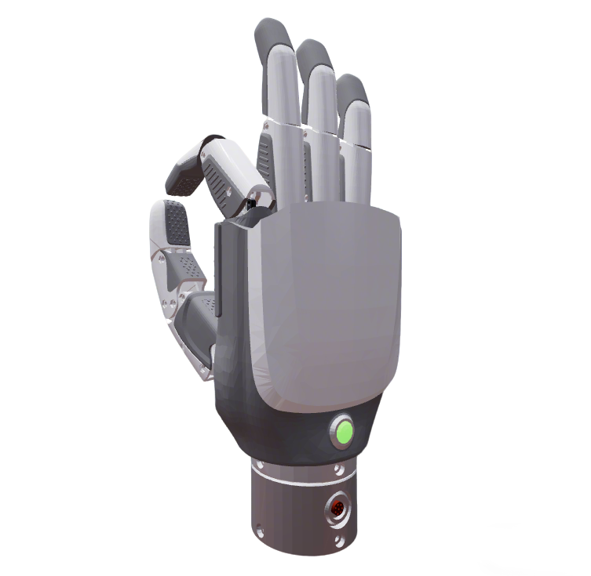

# Inspire Description

This package contains the URDF and related files for Inspire grippers and dexterous hands.

## 1. Build

```bash
cd ~/ros2_ws
colcon build --packages-up-to inspire_description --symlink-install
```

## 2. Visualize

### 2.1 EG2-4C2 Gripper

```bash
source ~/ros2_ws/install/setup.bash
ros2 launch robot_common_launch gripper.launch.py gripper:=inspire
```



### 2.2 RH56E2 Dexterous Hand

### RH56F2 Hand
Direction convention: `1` = left hand, `-1` = right hand.
* Left
  ```bash
  source ~/ros2_ws/install/setup.bash
  ros2 launch robot_common_launch hand.launch.py hand:=inspire type:=RH56F2
  ```
  
* Right
  ```bash
  source ~/ros2_ws/install/setup.bash
  ros2 launch robot_common_launch hand.launch.py hand:=inspire type:=RH56F2 direction:=-1
  ```

### RH56E2 Hand
Direction convention: `1` = left hand, `-1` = right hand.
* Left
* Left Hand
  ```bash
  source ~/ros2_ws/install/setup.bash
  ros2 launch robot_common_launch hand.launch.py hand:=inspire type:=RH56E2
  ```
  

* Right Hand
  ```bash
  source ~/ros2_ws/install/setup.bash
  ros2 launch robot_common_launch hand.launch.py hand:=inspire type:=RH56E2 direction:=-1
  ```
  

## 3. ROS2 Control Demo

### 3.1 RH56E2 Dexterous Hand

* Left Hand
  ```bash
  source ~/ros2_ws/install/setup.bash
  ros2 launch basic_joint_controller hand.launch.py hand:=inspire type:=RH56E2
  ```

* Right Hand
  ```bash
  source ~/ros2_ws/install/setup.bash
  ros2 launch basic_joint_controller hand.launch.py hand:=inspire type:=RH56E2 direction:=-1
  ```

## 4. Real Hardware with Modbus ROS2 Control

### 4.1 RH56E2 Dexterous Hand

* Left Hand
  ```bash
  source ~/ros2_ws/install/setup.bash
  ros2 launch basic_joint_controller hand.launch.py hand:=inspire type:=RH56E2 hardware:=real
  ```

* Right Hand
  ```bash
  source ~/ros2_ws/install/setup.bash
  ros2 launch basic_joint_controller hand.launch.py hand:=inspire type:=RH56E2 hardware:=real direction:=-1
  ```

### 4.2 Launch Parameters

- `hand:=inspire` - Hand name
- `type:=RH56E2` - Inspire RH56E2 dexterous hand
- `hardware:=real` - Use Modbus RTU hardware
- `direction:=-1` - Right hand

Default side is left hand. Inspire RH56E2 uses Modbus ID `2` for the left hand and ID `1` for the right hand.
