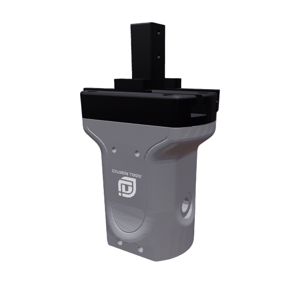

# Jodell Gripper Description

This package contains the URDF and related files for the Jodell RG75-300 Gripper.

## Build

```bash
cd ~/ros2_ws
colcon build --packages-up-to jodell_description --symlink-install
```

## Visualize the Gripper

### RG75-300 Series

* No Pad
  ```bash
  source ~/ros2_ws/install/setup.bash
  ros2 launch robot_common_launch gripper.launch.py gripper:=jodell
  ```
* FiveAges Pad
  ```bash
  source ~/ros2_ws/install/setup.bash
  ros2 launch robot_common_launch gripper.launch.py gripper:=jodell
  ```
  

* leapmotor pad
  ```bash
  source ~/ros2_ws/install/setup.bash
  ros2 launch robot_common_launch gripper.launch.py gripper:=jodell type:=RG75-leapmotor
  ```

* Heavy carry pad
  ```bash
  source ~/ros2_ws/install/setup.bash
  ros2 launch robot_common_launch gripper.launch.py gripper:=jodell type:=heavy_carry_left
  ```
  ```bash
  source ~/ros2_ws/install/setup.bash
  ros2 launch robot_common_launch gripper.launch.py gripper:=jodell type:=heavy_carry_right
  ```

* Ptc pad
  ```bash
  source ~/ros2_ws/install/setup.bash
  ros2 launch robot_common_launch gripper.launch.py gripper:=jodell type:=RG75-ptc
  ```